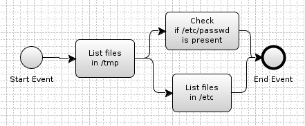
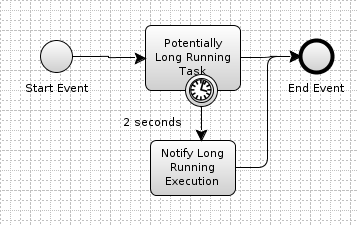

= Sample BPMN Projects for Adhesive

In order to facilitate learning some of the core features of Adhesive, this
project contains sample processes to showcase features from it.

== simple-process

A project that just shows basic task chaining, and getting values from the
names of the tasks.

== rest-endpoint

A project that shows how using the `message_callback` functionality allows
pushing events into the process from a webhook.

image:rest-endpoint/rest-endpoint.png[REST Endpoint]

== deduplication

A project that illustrates how to have event deduplication, where only the last
event is relevant for a resource, such as Kubernetes operators. Even if 10000
events will be generated, only around 3 will get processed.

image:deduplication/deduplication.png[Async Event Deduplication]

== async-deduplication

_DEPRECATED_: Use the `deduplicate` flag present on tasks since Adhesive 1.4.0.
This yields better performance and greatly simplifies the process.

A project that illustrates how to have event deduplication, where only the last
event is relevant for a resource, such as Kubernetes operators.

image:async-deduplication/async-deduplication.png[Async Event Deduplication]

== timer-notification

How to fire a notification if a task runs more than the expected time.

